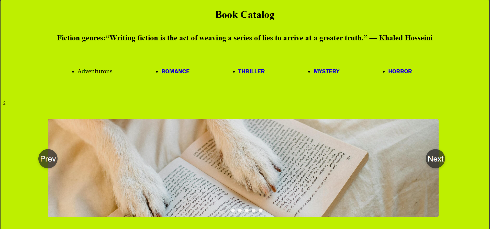

# 📚 Book Catalog

A beautiful and interactive React-based Book Catalog application showcasing various fiction genres with a modern UI and smooth navigation experience.



## ✨ Features

- 📖 **Multiple Fiction Genres**: Browse books across various categories:
  - Adventure
  - Romance
  - Thriller
  - Mystery
  - Horror
  - Educational/Study Materials

- 🎠 **Image Carousel**: Beautiful carousel slider showcasing featured book covers
- 🧭 **Navigation**: Smooth navigation between different book categories using React Router
- 💨 **Fast Performance**: Built with Vite for lightning-fast development and production builds
- 📱 **Responsive Design**: Optimized for different screen sizes
- 🎨 **Modern UI**: Clean and attractive user interface with custom styling

## 🛠️ Tech Stack

- **Frontend Framework**: React 19.1.1
- **Build Tool**: Vite 7.1.0
- **Routing**: React Router DOM 7.8.0
- **Styling**: CSS3
- **Development Tools**: ESLint, Babel

## 📦 Installation & Setup

### Prerequisites
- Node.js (v14 or higher)
- npm or yarn package manager

### Steps

1. **Clone the Repository**
```bash
git clone https://github.com/pragati23-ux/image-caraousel.git
cd "book catalog"
```

2. **Install Dependencies**
```bash
npm install
```

3. **Start Development Server**
```bash
npm run dev
```
The application will be available at `http://localhost:5173`

4. **Build for Production**
```bash
npm run build
```

5. **Preview Production Build**
```bash
npm preview
```

## 📁 Project Structure

```
book-catalog/
├── src/
│   ├── components/
│   │   ├── Header.jsx          # Header component
│   │   ├── Navbar.jsx          # Navigation bar
│   │   ├── Carousel.jsx        # Image carousel
│   │   ├── Adventrous.jsx      # Adventure books page
│   │   ├── Romance.jsx         # Romance books page
│   │   ├── Thriller.jsx        # Thriller books page
│   │   ├── Mystery.jsx         # Mystery books page
│   │   ├── Horror.jsx          # Horror books page
│   │   └── Study.jsx           # Educational content
│   ├── assests/
│   │   ├── 1.jpg to 5.jpg      # Carousel images
│   │   └── preview.png         # Preview image
│   ├── App.jsx                 # Main App component
│   ├── App.css                 # App styles
│   ├── index.css               # Global styles
│   └── main.jsx                # Application entry point
├── public/                      # Static assets
├── package.json                # Dependencies and scripts
├── vite.config.js              # Vite configuration
└── README.md                   # This file
```

## 🚀 Available Routes

| Route | Description |
|-------|-------------|
| `/` | Home page with featured books carousel |
| `/Adventrous` | Adventure fiction books |
| `/Romance` | Romance novels |
| `/Thriller` | Thriller books |
| `/Mystery` | Mystery novels |
| `/Horror` | Horror books |
| `/study/:bookId` | Individual book details page |

## 🎯 How to Use

1. **Browse Categories**: Click on any genre in the navigation bar to explore books in that category
2. **View Carousel**: Watch the featured books carousel on the home page
3. **Read Details**: Click on any book to view its details and additional information
4. **Navigate**: Use the navigation bar for smooth transitions between different sections

## 📝 Scripts

- `npm run dev` - Start development server with hot module replacement
- `npm run build` - Build optimized production bundle
- `npm run lint` - Run ESLint to check code quality
- `npm run preview` - Preview the production build locally

## 🎨 Styling

The project uses custom CSS for styling all components:
- `App.css` - Main application styles
- `Adventrous.css` - Adventure pages styles
- `Horror.css` - Horror pages styles
- `Mystery.css` - Mystery pages styles
- `Romance.css` - Romance pages styles
- `Thriller.css` - Thriller pages styles
- `index.css` - Global styles

## 🤝 Contributing

Contributions are welcome! Please feel free to submit a Pull Request with improvements or new features.

1. Fork the repository
2. Create your feature branch (`git checkout -b feature/AmazingFeature`)
3. Commit your changes (`git commit -m 'Add some AmazingFeature'`)
4. Push to the branch (`git push origin feature/AmazingFeature`)
5. Open a Pull Request

## 📄 License

This project is open source and available under the MIT License.

## 💡 Future Enhancements

- Add book search functionality
- Implement user authentication
- Add book reviews and ratings
- Create a wishlist feature
- Integrate with a backend API
- Add dark/light mode toggle

## 👨‍💻 Author

**Pragati Singh** - [GitHub Profile](https://github.com/pragati23-ux)

---

⭐ If you found this project useful, please consider giving it a star!

**Happy Reading! 📖✨**
